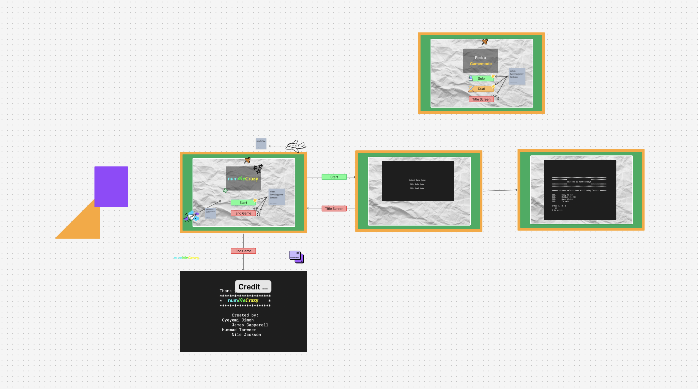

# 24q4-team2 Capstone Project(Number Guessing Game)

# numMeCrazy

### Our App
The numMeCrazy Game is an exciting and interactive project where players can enjoy a simple number-guessing game in either solo or dual mode. By following the project plan and adhering to best practices in design and development, we aim to deliver an engaging, functional, and well-documented game experience. The combination of randomness, difficulty scaling, and AI interaction makes it a fun challenge for players to test their number-guessing skills.

### Technologies and Server-side tools used: 

* Spring Boot 3.2.2
* JDK 17
* SQLITE Database
* Tomcat/10.1.18
* FLY.IO
* Docker
* React Vite
* Gradle

### Issues and Improvements 
#### Known Issues
* Missing Mobile-Friendly Features
#### How to Improve
* Incorporating more front-end styling into this game, It will significantly enhance the user experience

### Installation Instructions
Go to vs code terminal.

### Backend:
1. Clone the repository:

  * git clone https://github.com/code-differently/24q4-team2/tree/main/guessing-game-v2
  * cd guessing-game-v2 

2. Build the application and run:
   
  * gradle build 
  * gradle run

Here is link for Backend http://localhost:8081/
  
### Frontend:
1. Navigate to the directory:

  * cd guessing-game-v2/frontend

2. Install dependencies and run:
   
  * npm install
  * npm run dev

Here is the link Frontend: http://localhost:5173/

### Credits

* Animations: Created using CSS
* Database Management API: Powered by SQLITE
* Deployment: Hosted on FLY.IO
* App Details: Frontend - React, Styling - Tailwind, Backend - Java.

### Project Diagram:

### The Team

#### (members of Team2 and Anthony Mays)

